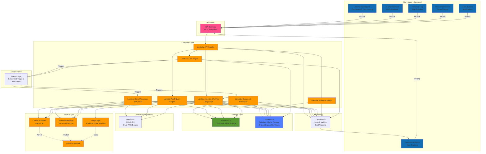
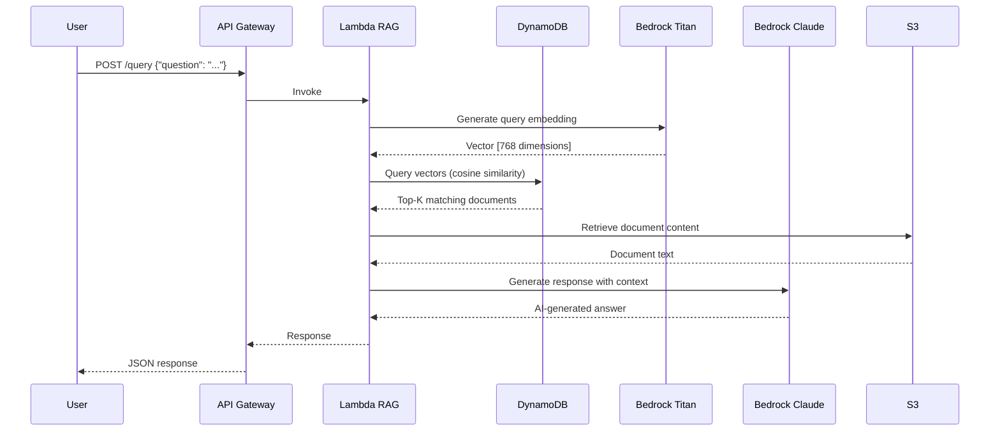
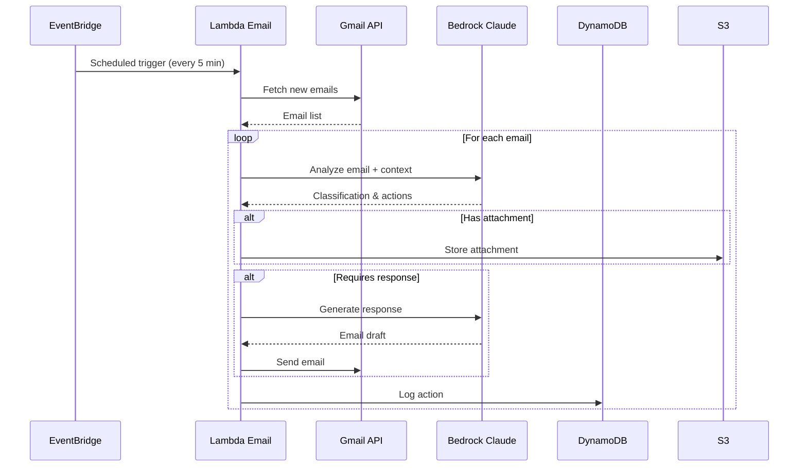
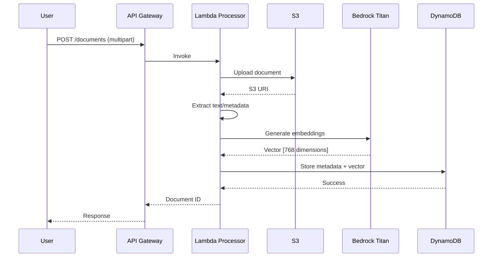
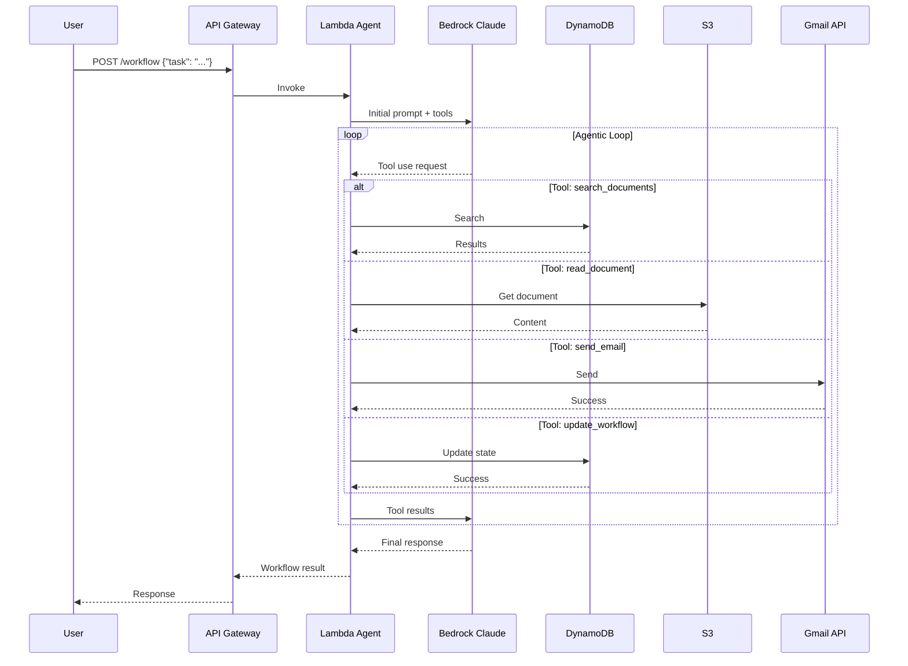
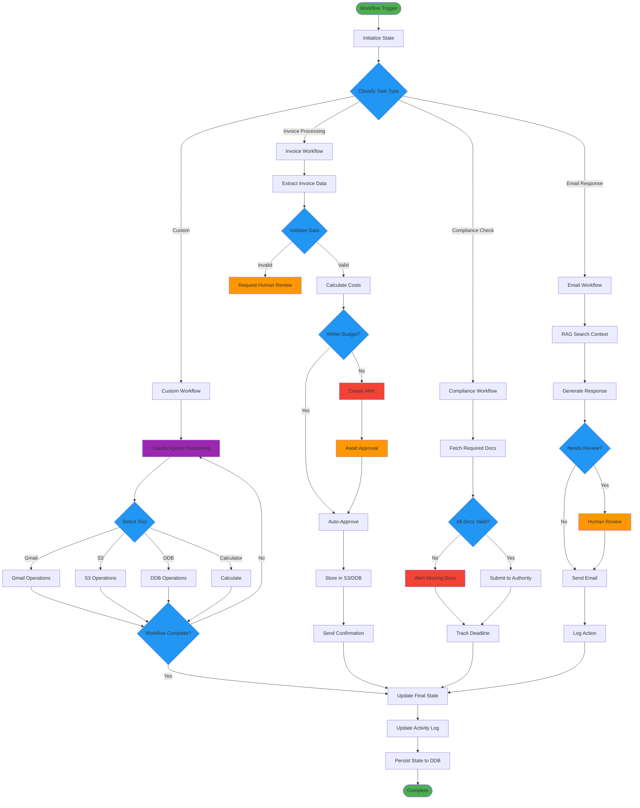
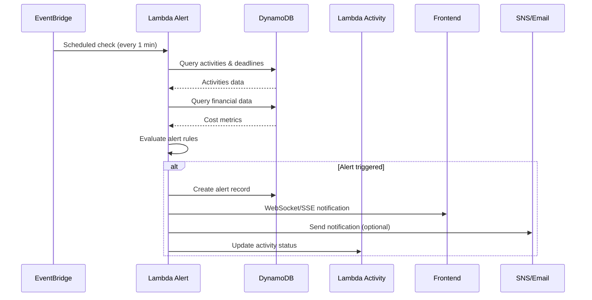
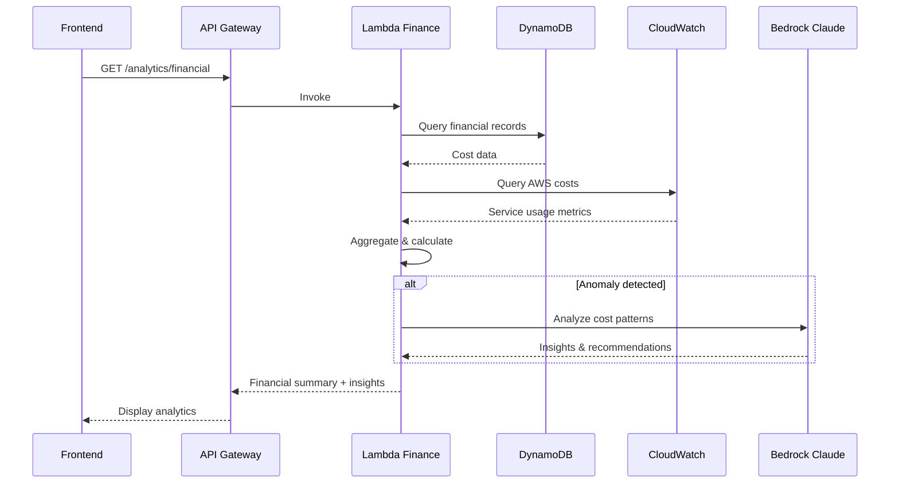
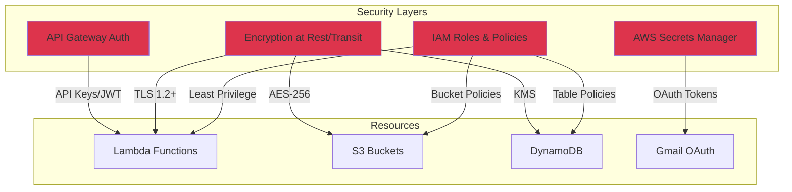

# HealthStream - System Architecture

## High-Level Architecture Diagram



## Detailed Component Interactions

### 1. RAG Pipeline Flow



### 2. Gmail Automation Flow



### 3. Document Ingestion Flow



### 4. Agentic Workflow Flow



### 5. LangGraph Agentic Workflow Architecture



**LangGraph State Machine Explanation:**

- **State Nodes**: Each box represents a state in the workflow
- **Conditional Edges**: Diamond shapes represent decision points
- **Human-in-the-Loop**: Orange nodes where human approval is required
- **Agent Reasoning**: Purple node where Claude makes autonomous decisions
- **Persistence**: All state changes are saved to DynamoDB for resumability
- **Branching**: Workflows can take different paths based on classification
- **Tool Use**: Agent can use multiple tools in sequence to complete tasks

### 6. Alert Generation Flow



### 7. Financial Analytics Data Flow



## Data Models

### DynamoDB Tables

#### 1. maritime-documents
```
{
  "document_id": "doc_123",
  "type": "invoice",
  "title": "Invoice #INV-2024-001",
  "s3_uri": "s3://maritime-docs/invoices/inv_001.pdf",
  "metadata": {
    "vendor": "Shipping Co",
    "date": "2024-11-01",
    "amount": 50000
  },
  "embedding": [0.123, 0.456, ...], // 768 dimensions
  "created_at": "2024-11-05T10:00:00Z"
}
```

#### 2. email-actions
```
{
  "action_id": "act_456",
  "email_id": "email_789",
  "timestamp": "2024-11-05T10:05:00Z",
  "from": "vendor@example.com",
  "subject": "Invoice Attached",
  "classification": "invoice_received",
  "actions_taken": ["stored_attachment", "sent_confirmation"],
  "status": "completed"
}
```

#### 3. workflow-states (LangGraph State Persistence)
```
{
  "workflow_id": "wf_789",
  "user_id": "user_123",
  "type": "vessel_clearance",
  "status": "in_progress",
  "current_state": "send_to_port_authority",
  "state_history": [
    {"state": "initialize", "timestamp": "2024-11-05T10:00:00Z"},
    {"state": "verify_documents", "timestamp": "2024-11-05T10:05:00Z"},
    {"state": "send_to_port_authority", "timestamp": "2024-11-05T10:10:00Z"}
  ],
  "context": {
    "vessel_name": "MV Ocean Star",
    "port": "Singapore",
    "documents_verified": true,
    "approval_needed": false
  },
  "langgraph_checkpoint": {
    "node": "send_to_port_authority",
    "thread_id": "thread_abc123",
    "checkpoint_data": "..."
  },
  "updated_at": "2024-11-05T10:10:00Z"
}
```

#### 4. ship-activities
```
{
  "activity_id": "act_ship_001",
  "ship_id": "ship_mv_ocean_star",
  "ship_name": "MV Ocean Star",
  "activity_type": "port_arrival",
  "status": "in_progress",
  "priority": "high",
  "start_time": "2024-11-05T08:00:00Z",
  "expected_end_time": "2024-11-05T18:00:00Z",
  "actual_end_time": null,
  "location": {
    "port": "Singapore",
    "berth": "12A",
    "coordinates": {"lat": 1.2897, "lon": 103.8501}
  },
  "related_documents": ["doc_123", "doc_456"],
  "related_emails": ["email_789"],
  "workflow_id": "wf_789",
  "financial_impact": {
    "estimated_cost": 25000,
    "actual_cost": 23500,
    "currency": "USD"
  },
  "created_by": "system",
  "updated_at": "2024-11-05T10:15:00Z",
  "tags": ["arrival", "customs", "high-priority"]
}
```

#### 5. concurrent-activities (GSI on ship-activities)
```
// Global Secondary Index on ship-activities table
// Partition Key: status (for querying in_progress activities)
// Sort Key: expected_end_time (for sorting by timeline)
// Projection: ALL

Query Example:
{
  "TableName": "ship-activities",
  "IndexName": "status-timeline-index",
  "KeyConditionExpression": "status = :status",
  "ExpressionAttributeValues": {":status": "in_progress"}
}
```

#### 6. alerts
```
{
  "alert_id": "alert_001",
  "alert_type": "compliance_deadline",
  "severity": "high",
  "status": "active",
  "title": "Certificate Renewal Due",
  "description": "Ship safety certificate expires in 3 days",
  "created_at": "2024-11-05T10:00:00Z",
  "triggered_at": "2024-11-05T10:00:00Z",
  "acknowledged_at": null,
  "resolved_at": null,
  "entity_type": "ship",
  "entity_id": "ship_mv_ocean_star",
  "related_activity_id": "act_ship_001",
  "related_document_id": "doc_safety_cert_123",
  "threshold_config": {
    "days_before_deadline": 3,
    "auto_escalate_days": 1
  },
  "actions_taken": [],
  "notification_channels": ["in_app", "email"],
  "recipients": ["user_123", "manager_456"],
  "metadata": {
    "deadline": "2024-11-08T23:59:59Z",
    "document_type": "safety_certificate",
    "renewal_cost_estimate": 5000
  }
}
```

#### 7. financial-data
```
{
  "finance_id": "fin_001",
  "transaction_type": "operational_expense",
  "category": "port_fees",
  "amount": 25000,
  "currency": "USD",
  "timestamp": "2024-11-05T10:00:00Z",
  "related_activity_id": "act_ship_001",
  "related_workflow_id": "wf_789",
  "ship_id": "ship_mv_ocean_star",
  "description": "Port arrival fees - Singapore",
  "budget_category": "operations",
  "budget_allocated": 30000,
  "budget_remaining": 5000,
  "status": "approved",
  "approved_by": "manager_456",
  "invoice_id": "doc_123",
  "vendor": "Singapore Port Authority",
  "payment_status": "pending",
  "payment_due_date": "2024-11-15T00:00:00Z",
  "tags": ["port_fees", "singapore", "mv_ocean_star"],
  "metadata": {
    "exchange_rate": 1.0,
    "original_amount": 25000,
    "original_currency": "USD"
  }
}
```

#### 8. email-embeddings (for RAG)
```
{
  "email_id": "email_789",
  "gmail_message_id": "msg_abc123",
  "thread_id": "thread_xyz789",
  "from": "vendor@example.com",
  "to": "operations@maritime.com",
  "subject": "Invoice for Port Services",
  "sent_date": "2024-11-05T09:00:00Z",
  "body_preview": "Please find attached invoice for port services...",
  "embedding": [0.234, 0.567, ...], // 768 dimensions
  "classification": "invoice",
  "sentiment": "neutral",
  "extracted_entities": {
    "vessel": "MV Ocean Star",
    "amount": 25000,
    "currency": "USD",
    "date": "2024-11-05"
  },
  "has_attachments": true,
  "attachment_s3_uris": ["s3://emails/attachments/inv_001.pdf"],
  "related_activity_ids": ["act_ship_001"],
  "processed": true,
  "actions_taken": ["stored_attachment", "created_activity", "sent_confirmation"]
}
```

#### 9. historical-activity-log (Time-Series Data)
```
{
  "log_id": "log_001",
  "timestamp": "2024-11-05T10:00:00Z",
  "activity_id": "act_ship_001",
  "ship_id": "ship_mv_ocean_star",
  "event_type": "status_change",
  "event_description": "Activity status changed from 'scheduled' to 'in_progress'",
  "old_value": "scheduled",
  "new_value": "in_progress",
  "changed_by": "system",
  "workflow_id": "wf_789",
  "related_documents": ["doc_123"],
  "metadata": {
    "trigger": "email_received",
    "trigger_id": "email_789"
  },
  "ttl": 1762358400  // Auto-delete after 1 year (optional)
}
```

## API Endpoints

### 1. RAG Chat & Query APIs

```
POST   /api/v1/chat/query
  Body: {
    "message": "string",
    "conversation_id": "optional",
    "include_emails": boolean,
    "include_documents": boolean
  }
  Response: {
    "answer": "string",
    "sources": [
      {"type": "document|email", "id": "...", "excerpt": "..."}
    ],
    "conversation_id": "string"
  }

GET    /api/v1/chat/conversations
  Query: ?limit=20&offset=0
  Response: {
    "conversations": [...],
    "pagination": {...}
  }

GET    /api/v1/chat/conversations/{id}
  Response: {
    "conversation": {...},
    "messages": [...]
  }
```

### 2. Document Management APIs

```
POST   /api/v1/documents
  Body: multipart/form-data (file + metadata)
  Response: {
    "document_id": "string",
    "status": "processing",
    "s3_uri": "string"
  }

GET    /api/v1/documents
  Query: ?type=invoice&ship_id=...&limit=50&offset=0
  Response: {
    "documents": [...],
    "pagination": {...}
  }

GET    /api/v1/documents/{id}
  Response: {
    "document": {...},
    "content": "string",
    "related_activities": [...]
  }

DELETE /api/v1/documents/{id}
  Response: { "status": "deleted" }

GET    /api/v1/documents/{id}/download
  Response: Binary file stream
```

### 3. Ship Activity APIs

```
GET    /api/v1/activities
  Query: ?status=in_progress&ship_id=...&limit=50&offset=0
  Response: {
    "activities": [...],
    "pagination": {...}
  }

GET    /api/v1/activities/concurrent
  Query: ?ship_id=...
  Response: {
    "concurrent_activities": [
      {
        "activity_id": "...",
        "ship_name": "...",
        "activity_type": "...",
        "status": "in_progress",
        "progress_percent": 65,
        "expected_end_time": "..."
      }
    ]
  }

GET    /api/v1/activities/forthcoming
  Query: ?days_ahead=7&ship_id=...
  Response: {
    "forthcoming_activities": [...]
  }

GET    /api/v1/activities/{id}
  Response: {
    "activity": {...},
    "related_documents": [...],
    "related_emails": [...],
    "workflow": {...},
    "financial_impact": {...}
  }

POST   /api/v1/activities
  Body: {
    "ship_id": "string",
    "activity_type": "string",
    "start_time": "ISO8601",
    "expected_end_time": "ISO8601",
    "metadata": {...}
  }
  Response: {
    "activity_id": "string",
    "status": "created"
  }

PATCH  /api/v1/activities/{id}
  Body: { "status": "completed", "actual_end_time": "ISO8601" }
  Response: { "activity": {...} }

GET    /api/v1/activities/{id}/history
  Response: {
    "history": [
      {
        "timestamp": "...",
        "event_type": "...",
        "description": "...",
        "changed_by": "..."
      }
    ]
  }
```

### 4. Historical Activity Log APIs

```
GET    /api/v1/history
  Query: ?ship_id=...&start_date=...&end_date=...&limit=100&offset=0
  Response: {
    "logs": [...],
    "pagination": {...},
    "total_count": number
  }

GET    /api/v1/history/search
  Query: ?query=...&ship_id=...&event_type=...
  Response: {
    "logs": [...],
    "pagination": {...}
  }

GET    /api/v1/history/export
  Query: ?ship_id=...&format=csv|json|pdf&start_date=...&end_date=...
  Response: Binary file download
```

### 5. Alert APIs

```
GET    /api/v1/alerts
  Query: ?status=active&severity=high&limit=50&offset=0
  Response: {
    "alerts": [...],
    "pagination": {...},
    "unread_count": number
  }

GET    /api/v1/alerts/{id}
  Response: {
    "alert": {...},
    "related_activity": {...},
    "related_document": {...}
  }

POST   /api/v1/alerts/{id}/acknowledge
  Body: { "acknowledged_by": "user_id" }
  Response: { "alert": {...} }

POST   /api/v1/alerts/{id}/resolve
  Body: {
    "resolved_by": "user_id",
    "resolution_notes": "string"
  }
  Response: { "alert": {...} }

POST   /api/v1/alerts/rules
  Body: {
    "rule_type": "compliance_deadline|budget_threshold|...",
    "conditions": {...},
    "notification_channels": ["in_app", "email"],
    "recipients": [...]
  }
  Response: { "rule_id": "string" }

GET    /api/v1/alerts/rules
  Response: { "rules": [...] }

DELETE /api/v1/alerts/rules/{id}
  Response: { "status": "deleted" }
```

### 6. Financial & Analytics APIs

```
GET    /api/v1/analytics/financial
  Query: ?ship_id=...&start_date=...&end_date=...&category=...
  Response: {
    "summary": {
      "total_expenses": number,
      "by_category": {...},
      "by_ship": {...},
      "budget_utilization": number
    },
    "transactions": [...],
    "insights": [
      {
        "type": "anomaly|trend|recommendation",
        "description": "...",
        "impact": "high|medium|low"
      }
    ]
  }

GET    /api/v1/analytics/financial/trends
  Query: ?period=7d|30d|90d&ship_id=...
  Response: {
    "trends": [
      {
        "date": "...",
        "amount": number,
        "category": "..."
      }
    ],
    "forecast": {...}
  }

POST   /api/v1/financial/transactions
  Body: {
    "amount": number,
    "currency": "USD",
    "category": "port_fees|fuel|maintenance|...",
    "related_activity_id": "...",
    "description": "...",
    "metadata": {...}
  }
  Response: { "finance_id": "string" }

GET    /api/v1/financial/transactions
  Query: ?ship_id=...&category=...&start_date=...&end_date=...
  Response: {
    "transactions": [...],
    "pagination": {...}
  }

GET    /api/v1/financial/budget
  Query: ?category=...&ship_id=...
  Response: {
    "budgets": [
      {
        "category": "...",
        "allocated": number,
        "spent": number,
        "remaining": number,
        "utilization_percent": number
      }
    ]
  }

GET    /api/v1/analytics/operational
  Query: ?ship_id=...&metric=efficiency|turnaround_time|...
  Response: {
    "metrics": {
      "avg_turnaround_time": number,
      "on_time_completion_rate": number,
      "efficiency_score": number
    },
    "kpis": [...]
  }
```

### 7. Workflow APIs (LangGraph)

```
POST   /api/v1/workflows
  Body: {
    "type": "invoice_processing|compliance_check|email_response|custom",
    "parameters": {...},
    "trigger_source": "manual|email|scheduled"
  }
  Response: {
    "workflow_id": "string",
    "status": "initiated",
    "langgraph_thread_id": "string"
  }

GET    /api/v1/workflows/{id}
  Response: {
    "workflow": {...},
    "current_state": "string",
    "state_history": [...],
    "progress": {
      "steps_completed": number,
      "steps_total": number,
      "percent": number
    }
  }

POST   /api/v1/workflows/{id}/approve
  Body: {
    "approved_by": "user_id",
    "comments": "optional"
  }
  Response: { "workflow": {...} }

POST   /api/v1/workflows/{id}/cancel
  Response: { "workflow": {...} }

GET    /api/v1/workflows
  Query: ?status=in_progress&type=...&limit=50
  Response: {
    "workflows": [...],
    "pagination": {...}
  }
```

### 8. Gmail Integration APIs

```
POST   /api/v1/gmail/sync
  Body: {
    "force": boolean,
    "max_results": number
  }
  Response: {
    "emails_processed": number,
    "actions": [
      {
        "email_id": "...",
        "classification": "...",
        "actions_taken": [...]
      }
    ]
  }

GET    /api/v1/gmail/emails
  Query: ?classification=...&processed=true&limit=50
  Response: {
    "emails": [...],
    "pagination": {...}
  }

GET    /api/v1/gmail/emails/{id}
  Response: {
    "email": {...},
    "extracted_entities": {...},
    "related_activities": [...],
    "actions_taken": [...]
  }

POST   /api/v1/gmail/search
  Body: {
    "query": "string",
    "use_rag": boolean
  }
  Response: {
    "emails": [...],
    "semantic_matches": [...]
  }
```

### 9. Health & System APIs

```
GET    /api/v1/health
  Response: {
    "status": "healthy",
    "services": {
      "bedrock": "up",
      "dynamodb": "up",
      "s3": "up",
      "gmail": "up"
    },
    "timestamp": "..."
  }

GET    /api/v1/stats
  Response: {
    "total_activities": number,
    "active_workflows": number,
    "unread_alerts": number,
    "total_documents": number,
    "total_ships": number
  }
```

## Infrastructure as Code

### Recommended Deployment Structure

```
infrastructure/
├── lambda/
│   ├── api_handler/              # Main API router
│   │   ├── handler.py
│   │   └── requirements.txt
│   ├── document_processor/       # Document ingestion & embeddings
│   │   ├── handler.py
│   │   └── requirements.txt
│   ├── email_processor/          # Gmail sync & RAG processing
│   │   ├── handler.py
│   │   ├── gmail_client.py
│   │   └── requirements.txt
│   ├── rag_engine/               # RAG query & chat
│   │   ├── handler.py
│   │   ├── retrieval.py
│   │   └── requirements.txt
│   ├── agentic_workflow/         # LangGraph workflows
│   │   ├── handler.py
│   │   ├── workflows/
│   │   │   ├── invoice_workflow.py
│   │   │   ├── compliance_workflow.py
│   │   │   └── email_workflow.py
│   │   └── requirements.txt
│   ├── activity_manager/         # Ship activities CRUD
│   │   ├── handler.py
│   │   └── requirements.txt
│   ├── alert_engine/             # Alert generation & rules
│   │   ├── handler.py
│   │   ├── rules_engine.py
│   │   └── requirements.txt
│   ├── financial_analytics/      # Cost tracking & analytics
│   │   ├── handler.py
│   │   ├── analytics.py
│   │   └── requirements.txt
│   └── historical_logger/        # Activity logging
│       ├── handler.py
│       └── requirements.txt
├── layers/
│   ├── langgraph_layer/          # LangGraph + LangChain
│   │   └── python/
│   ├── aws_sdk_layer/            # boto3 + extras
│   │   └── python/
│   └── common_utils/             # Shared utilities
│       └── python/
├── frontend/                     # React application (optional)
│   ├── src/
│   │   ├── components/
│   │   │   ├── Dashboard.jsx
│   │   │   ├── ChatInterface.jsx
│   │   │   ├── ActivityLog.jsx
│   │   │   ├── DocumentViewer.jsx
│   │   │   ├── AlertPanel.jsx
│   │   │   └── FinanceAnalytics.jsx
│   │   ├── api/
│   │   └── App.jsx
│   ├── public/
│   └── package.json
├── dynamodb/
│   └── table_definitions/
│       ├── ship_activities.json
│       ├── alerts.json
│       ├── financial_data.json
│       ├── workflow_states.json
│       └── ...
├── eventbridge/
│   └── rules/
│       ├── email_sync_rule.json
│       ├── alert_check_rule.json
│       └── workflow_scheduler_rule.json
├── template.yaml (AWS SAM)
├── samconfig.toml
└── config/
    ├── dev.json
    └── prod.json
```

### Lambda Function Mapping

| Lambda Function | Trigger | Purpose | Memory | Timeout |
|----------------|---------|---------|--------|---------|
| api_handler | API Gateway | Route API requests | 512MB | 30s |
| document_processor | S3 Event | Process uploaded docs | 1024MB | 300s |
| email_processor | EventBridge (5min) | Sync Gmail & process | 1024MB | 300s |
| rag_engine | API Gateway | RAG queries | 1024MB | 60s |
| agentic_workflow | API Gateway, EventBridge | LangGraph workflows | 2048MB | 900s |
| activity_manager | API Gateway | Activity CRUD | 512MB | 30s |
| alert_engine | EventBridge (1min) | Check & trigger alerts | 512MB | 60s |
| financial_analytics | API Gateway | Financial queries | 512MB | 30s |
| historical_logger | DynamoDB Stream | Log activity changes | 256MB | 15s |

## Security Architecture



## Cost Breakdown (Monthly Estimates)

### Free Tier Services
| Service | Free Tier | Expected Usage | Cost |
|---------|-----------|----------------|------|
| Lambda | 1M requests, 400K GB-sec | 100K requests, 50K GB-sec | $0 |
| API Gateway | 1M calls (12 months) | 100K calls | $0 |
| S3 | 5GB, 20K GET, 2K PUT | 2GB, 10K GET, 500 PUT | $0 |
| DynamoDB | 25GB, 25 RCU/WCU | 5GB, 10 RCU/WCU | $0 |
| CloudWatch | 5GB logs | 2GB logs | $0 |

### Pay-per-Use Services
| Service | Pricing | Expected Usage | Cost |
|---------|---------|----------------|------|
| Bedrock Claude 3 Sonnet | $3/MTok in, $15/MTok out | 500K in, 100K out | $3.00 |
| Bedrock Titan Embeddings | $0.10/MTok | 1M tokens | $0.10 |

**Total: ~$3-10/month for MVP usage**

## Scalability Considerations

### Current Limits
- Lambda: 1,000 concurrent executions (default)
- DynamoDB: 40K RCU/WCU per table (on-demand)
- API Gateway: 10,000 requests per second

### Scaling Path
1. **Phase 1 (MVP)**: Current architecture
2. **Phase 2 (100+ users)**: Add CloudFront CDN, increase Lambda concurrency
3. **Phase 3 (1000+ users)**: Migrate to OpenSearch for vector search, add Aurora Serverless
4. **Phase 4 (Enterprise)**: Multi-region deployment, dedicated vector DB (Pinecone/Weaviate)

## Monitoring Dashboard

### Key Metrics to Track
- Lambda invocation count and duration
- API Gateway latency (p50, p95, p99)
- Bedrock token usage (input/output)
- DynamoDB read/write capacity
- S3 storage size and request count
- Gmail API quota usage
- Error rates per Lambda function
- Cost per day/week/month

### CloudWatch Alarms
- Lambda error rate > 5%
- API Gateway 5xx errors > 10/min
- DynamoDB throttled requests > 0
- Daily cost > $5
- Gmail API quota > 80%
